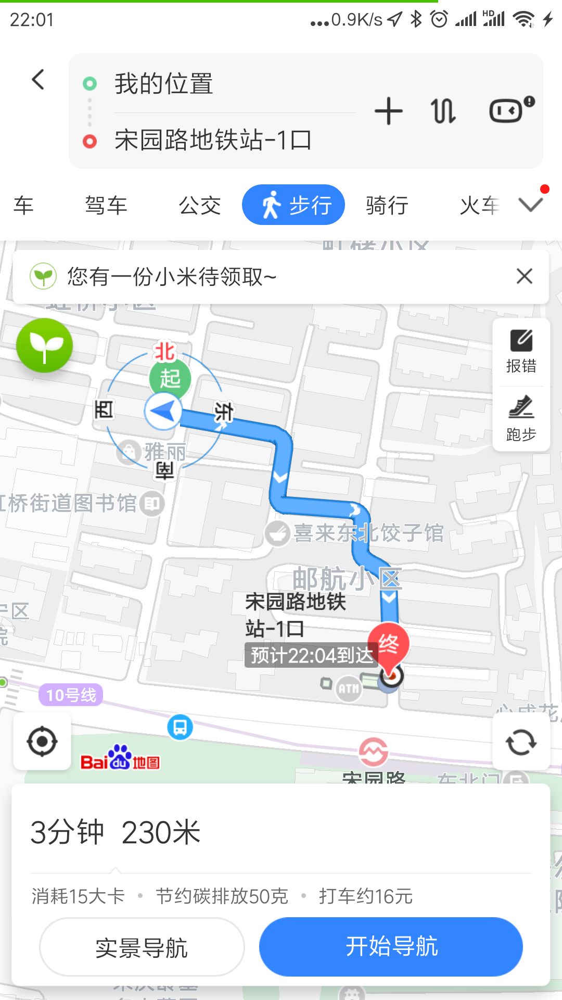

# 基础信息
标题: 10号线宋园路虹桥路虹桥小区离地铁站近朝南带阳台两居室可养宠物  
电话/微信: 18801903271, 邮箱: ramwin@qq.com, QQ: 1175190234  
楼层: 6楼/共6层  
房源: 自如整租  
面积: 48.89平方米(主卧16平方米，次卧14平方米，厨房卫生间10平方米)  
可住: 1至2人  
价格: 主卧3800, 次卧3400. 除水电煤费外无其他费用    
支付方式: 押一付一
水电煤: 我们平摊，价格是居民用电用水(电(谷)0.307元/度， 电(平)0.617元/度，水3.45元/吨，燃气3元/立方)  
装修: 自如精装  
出租原因: 之前是女友表妹住，现在她大学开学了，所以准备租出去一间  
视频: [https://raw.githubusercontent.com/ramwin/hongqiao/master/%E5%B0%8F%E5%B0%BA%E5%AF%B8/%E8%A7%86%E9%A2%91.mp4](https://raw.githubusercontent.com/ramwin/hongqiao/master/%E5%B0%8F%E5%B0%BA%E5%AF%B8/%E8%A7%86%E9%A2%91.mp4)
宠物: 我自己就一只乌龟，欢迎你养猫养狗
简介: 欢迎前来看房，你可以选择主卧或者次卧。公共区域可以各用一半;阳台只给主卧的住户使用;主卧阳台外面的杆子(用来晒被子)共同使用。图片都只有一百到几百kb，视频是11.7M，请放心打开。欢迎打电话，加微信，发邮件。如果有不清楚的地方也希望你能告知一下，我这边立马更新.  
[网址](https://github.com/ramwin/hongqiao): https://github.com/ramwin/hongqiao

# 优点
## 双朝南
2个房间都是朝南，主卧和次卧一样大，主卧有阳台。主卧外面有伸出去的杆子，可以同时晒4床被子

## 离地铁站真的太近了
地理位置: 距离宋园路地铁站仅仅230米，走路3分钟.并且10号线早上不是很挤(10号线和13号线是上海最不挤的地铁线)  
这里的230米是真的230米，自如上其他房源是按照小区到地铁站距离来计算的，所以都会写得比实际小很多。  
有些APP更加离谱，是按照直线最短距离来计算的。  
* 到徐家汇: 打车9分钟
* 到虹桥火车站: 走路3分钟 + 地铁17分钟
* 到陆家嘴: 走路3分钟 + 地铁30分钟
* 到世纪大道: 走路3分钟 + 地铁35分钟

## 家具应有尽有，宽带毫无延迟
* 冰箱，洗衣机，微波炉，燃气灶，热水器，烤箱都有
* 宽带网速飞快，wifi信号很好，电信网打游戏无延迟，我用无线网测试都有53.93Mbps(另外我是程序员，可以让你安心地用谷歌学术，facebook哦).
* 如果你住次卧，我免费晾衣架.

## 生活环境好, 适合安静学习
* 在上海，不想被淘汰掉，保证自己的学习进步是必要的
* 和大马路中间隔着三幢楼，晚上睡觉一点声音都没有
* 楼下有虹桥街道图书馆，夏天和冬天在里面看书最舒服了。可以免费借书
* 因为在顶楼，所以不会有小孩子蹦蹦跳跳的声音

## 自如服务好, 现在很安全
* 这是自如的深呼吸房源，空气甲醛都已检测，之前已有人入住
* 自如的服务还是不错的，不管什么家具坏了，都可以让人过来修（时间自己定）
* 每个月有一次保洁服务，会把卧室厨房卫生间都打扫得干干净净

## 菜市场，公园大商场，景点都有
* 楼下就是菜市场: 旁边有虹西市场，里面家鸭鱼肉，水果蔬菜种类丰富
* 8分钟走到新虹桥中心公园(这个公园好大): 走路670米(真的是670米). 距离1.3公里处还有个虹桥公园
* 在上海扔垃圾不容易，但是我们小区从房屋走到地铁的小区出口有垃圾站，每天早上7点到9点收垃圾，晚上5点到7点收垃圾。每天早上扔垃圾很方便。往另一个方向走1分钟，有个24小时收垃圾的垃圾站，真的很方便。
* 距离700米有高岛屋百货，骑车5分钟距离1.2公里有尚嘉中心（里面的东西真的太贵了555）和南丰城（周六周日逛几圈真的不错）
* 小区对面是宋庆龄陵园，可以去参观

## 价格对比
* 整租一室一厅是5090+410=5500元(自如整租收8%的服务费，合租收10%的服务费)
* 附近的合租朝南房间是3390+339=3729元(但是这个是3居室面积比我的小，我这里是2居室，那个房间离地铁站的位置估计比我差很多)
* 附近的合租朝北房间是2590+259=2849元(但是只有7平方米，还是3居室，可能你要和4个人一起住)

## 我和女友的性格很好哦

# 缺点
没错，我就是这么老实，缺点也列举一下
1. 在6楼，每天爬上爬下(当锻炼其实也不错)
2. 卫生间没有洗脸池，需要去厨房洗漱。我和我女友都是早上8点到8点10分洗漱。
3. 没有客厅(但是我们在厨房放了个餐桌，冰箱移动到了旁边，可以当作客厅用)
4. 价格. 虽然在优点里也说了价格，但上海市区就是这么贵啊。算是附近所有小区的共同缺点了。
5. 洗衣机在主卧的阳台上，次卧的住户方便使用时，主卧的人要让他使用。但是总归没有公共区域的那种来得那么自由

# 照片和视频
* 视频
[https://raw.githubusercontent.com/ramwin/hongqiao/master/%E5%B0%8F%E5%B0%BA%E5%AF%B8/%E8%A7%86%E9%A2%91.mp4](https://raw.githubusercontent.com/ramwin/hongqiao/master/%E5%B0%8F%E5%B0%BA%E5%AF%B8/%E8%A7%86%E9%A2%91.mp4)
* 次卧\_从窗户拍

* 次卧\_从门口拍

* 餐桌

* 冰箱

* 到地铁站的距离

* 到公园

* 到商场

* 价格对比

* 网速

# 发布平台
